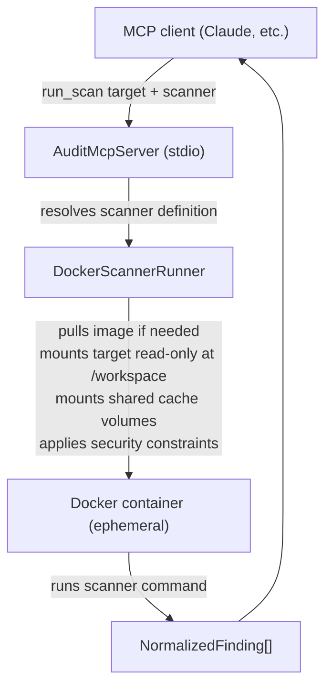

# audit-mcp

An [MCP](https://modelcontextprotocol.io/) server that runs static analysis and security scanners inside isolated Docker containers and returns normalized findings with remediation context.

Point it at any directory and your AI assistant can audit it — without installing a single scanner locally.

## Features

- **70+ scanners** across Rust, Go, Python, Node, Java, Ruby, PHP, .NET, and C/C++
- **Fully isolated** — every scanner runs in its own ephemeral Docker container with a read-only workspace mount, `no-new-privileges`, and all Linux capabilities dropped
- **Persistent cache** — named Docker volumes share downloaded packages and compiled artifacts across runs so repeated scans are fast
- **MCP-native** — exposes `list_scanners`, `run_scan`, `explain_finding`, and `suggest_fixes` as structured tools any MCP client can call
- **Language auto-detection** — `mode=all` infers the right scanners from the target path

## Requirements

- Rust 1.88+ (build only)
- Docker (running daemon, accessible via the default socket)

## Installation

```bash
git clone https://github.com/mbround18/audit-mcp
cd audit-mcp
cargo build --release
```

The binary is at `target/release/audit-mcp`. It communicates over stdio, so it is wired up as an MCP server in your client's configuration file.

### Claude Code / Claude Desktop

```json
{
  "mcpServers": {
    "audit": {
      "command": "/path/to/audit-mcp"
    }
  }
}
```

## Tools

### `list_scanners`

Returns the full scanner catalog with names, descriptions, and categories. No arguments.

### `run_scan`

| Field      | Type                          | Description                                   |
| ---------- | ----------------------------- | --------------------------------------------- |
| `target`   | `string`                      | Absolute path to the directory to scan        |
| `mode`     | `"single" \| "many" \| "all"` | How scanners are selected (default: `single`) |
| `scanner`  | `string`                      | Scanner name — required when `mode=single`    |
| `scanners` | `string[]`                    | Scanner names — required when `mode=many`     |

`mode=all` auto-selects scanners by inferring the project language from the target path.

### `explain_finding`

Takes a scanner name and finding ID, returns a plain-language explanation and remediation steps.

### `suggest_fixes`

Takes an array of normalized findings, returns minimal fix suggestions.

## Supported languages and scanners

| Language | Scanners                                                                                                                                                         |
| -------- | ---------------------------------------------------------------------------------------------------------------------------------------------------------------- |
| Rust     | `cargo-audit`, `cargo-clippy`, `cargo-deny`, `cargo-fmt`, `cargo-machete`, `cargo-bloat`, `cargo-tarpaulin`, `cargo-llvm-cov`, `cargo-outdated`, `cargo-mutants` |
| Go       | `govulncheck`, `gosec`, `golangci-lint`, `staticcheck`, `goimports`, `gocyclo`, `nilaway`, `ineffassign`, `go-carpet`                                            |
| Python   | `bandit`, `safety`, `ruff`, `black`, `mypy`, `pip-audit`, `vulture`, `flake8`, `isort`, `radon`                                                                  |
| Node     | `knip`, `snyk`, `retire`, `auditjs`, `eslint`, `prettier`, `depcheck`, `license-checker`, `lighthouse`, `bundlephobia`                                           |
| Java     | `spotbugs`, `pmd`, `checkstyle`, `snyk-java`, `google-java-format`, `palantir-java-format`, `dependency-check`, `error-prone`, `jdk-flight-recorder`             |
| Ruby     | `brakeman`, `bundler-audit`, `rubocop`, `pronto`, `debride`, `flay`, `flog`, `standardrb`, `license_finder`                                                      |
| PHP      | `phpstan`, `psalm`, `phpcs`, `rector`, `enlightn`                                                                                                                |
| .NET     | `dotnet-format`, `roslyn-analyzers`, `dotnet-sonarscanner`, `dotnet-snyk`, `jb-inspectcode`                                                                      |
| C/C++    | `clang-tidy`, `cppcheck`, `clang-format`, `flawfinder`                                                                                                           |

## How it works



Cache volumes are named `audit-cargo-home`, `audit-go-mod-cache`, `audit-uv-tools`, etc. — one set per language, shared across all scanners that use the same ecosystem. Per-scanner build artifact volumes (`audit-target-<scanner>`) prevent cross-scanner collisions.

## Development

```bash
# type-check
cargo check

# run tests
cargo test

# lint
cargo clippy -- -D warnings

# format check
cargo fmt -- --check

# run the server (reads MCP messages from stdin)
cargo run
```

See [docs/ARCHITECTURE.md](docs/ARCHITECTURE.md) for a deeper walkthrough of the module structure.

## License

[BSD 3-Clause](LICENSE) — Copyright (c) 2025 MBRound18
