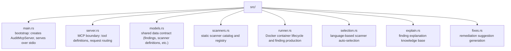
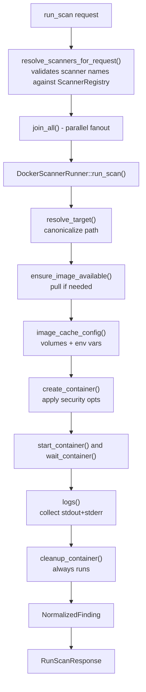

# Architecture

## Overview

`audit-mcp` is a single Rust binary that speaks the [Model Context Protocol](https://modelcontextprotocol.io/) over stdio. It exposes four tools to any MCP-compatible client and executes all scanner work inside ephemeral Docker containers.

## Module responsibilities

### `main.rs`

Process entry point only. Creates an `AuditMcpServer`, wraps it in the RMCP stdio transport, and blocks until the client disconnects.

### `server.rs`

The MCP surface. Defines tool request/response DTOs and wires them to handler methods via the `#[tool_router]` and `#[tool_handler]` RMCP macros. Nothing in this file touches Docker or filesystem.

Tools:
- `list_scanners` — delegates to `ScannerRegistry::list_summaries`
- `run_scan` — validates request, resolves scanner set, fans out to `DockerScannerRunner` in parallel with `join_all`
- `explain_finding` — delegates to `FindingExplainer`
- `suggest_fixes` — delegates to `FixEngine`

### `models.rs`

The shared data contract. All cross-module payload types live here:

- `ScannerDefinition` — name, image, command template, optional install script
- `NormalizedFinding` — scanner-agnostic finding shape with severity, location, fingerprint, and raw output
- `ScanExecution` — execution metadata attached to a completed scan
- `ToolSelectionPlan` — which scanners were chosen and why
- `RunScanResponse` — full response envelope

Changes to the finding shape should be made here first.

### `scanners.rs`

A static in-memory catalog of all supported scanners. `ScannerRegistry` is built at startup from hardcoded `ScannerDefinition` entries and validates that every entry has a non-empty image and command template before the server begins accepting requests.

Scanner builder helpers (`rust_scanner_with_install`, `python_scanner`, etc.) reduce duplication.

### `runner.rs`

The Docker layer. `DockerScannerRunner` owns a `bollard::Docker` client and is responsible for:

1. Pinging the daemon before each run
2. Resolving the target to a canonical absolute path
3. Pulling the scanner image if absent
4. Creating, starting, and waiting for the container
5. Reading logs and mapping them to `NormalizedFinding`
6. Cleaning up the container regardless of outcome

**Security constraints applied to every container:**

| Constraint | Value | Reason |
|---|---|---|
| Workspace mount | `:ro` | Scanner cannot modify source |
| `SecurityOpt` | `no-new-privileges:true` | Blocks setuid/sudo escalation |
| `CapDrop` | `ALL` | Removes all Linux capabilities |
| `Memory` | 4 GB | Bounds compiler memory usage |

**Cache volumes** are named Docker volumes mounted at `/cache/*` inside the container. Environment variables (`CARGO_HOME`, `UV_CACHE_DIR`, `GEM_HOME`, etc.) redirect each ecosystem's tooling to those paths. This means package downloads and compiled artifacts persist across runs without any host filesystem exposure.

Per-scanner target volumes (`audit-target-<scanner>`) prevent concurrent scanners from writing conflicting build artifacts into a shared directory.

**Bollard quirk:** Docker's wait API surfaces non-zero container exits as `Err(DockerContainerWaitError { code, .. })` rather than `Ok(WaitContainerResponse { status_code })`. The runner intercepts this variant and converts it to a synthetic response so the exit code is handled uniformly.

### `selection.rs`

`ToolSelector` maps a target path to a set of scanner names by matching file extensions and path components against per-language profiles. Used only when `mode=all` is requested. The inferred scanner set is intersected with the live registry so deleted or renamed scanners never appear in results.

### `explain.rs` / `fixes.rs`

Knowledge-base modules that return contextual explanations and fix suggestions given a scanner name and finding. Currently scaffolded — extend by adding scanner-specific entries.

## Data flow

## Adding a new scanner

1. Add a `ScannerDefinition` entry in `scanners.rs` using the appropriate language builder.
2. If the tool is not pre-installed in the base image, set `install_script` to a shell command that installs it (e.g. `"cargo install cargo-foo --locked"`).
3. Add the scanner name to the relevant `LanguageToolProfile` in `selection.rs` so `mode=all` can discover it.
4. Verify `cargo test` passes — the registry validates every entry at construction time.

## Adding a new language

1. Add a language builder function in `scanners.rs` (e.g. `swift_scanner`).
2. Add entries for all scanners in that ecosystem.
3. Add a `LanguageToolProfile` in `selection.rs`.
4. Extend `image_cache_config` in `runner.rs` to cover the new image pattern and redirect its cache directories to named volumes.
5. Extend `infer_language` in `selection.rs` to recognize the new file extensions and manifest names.
